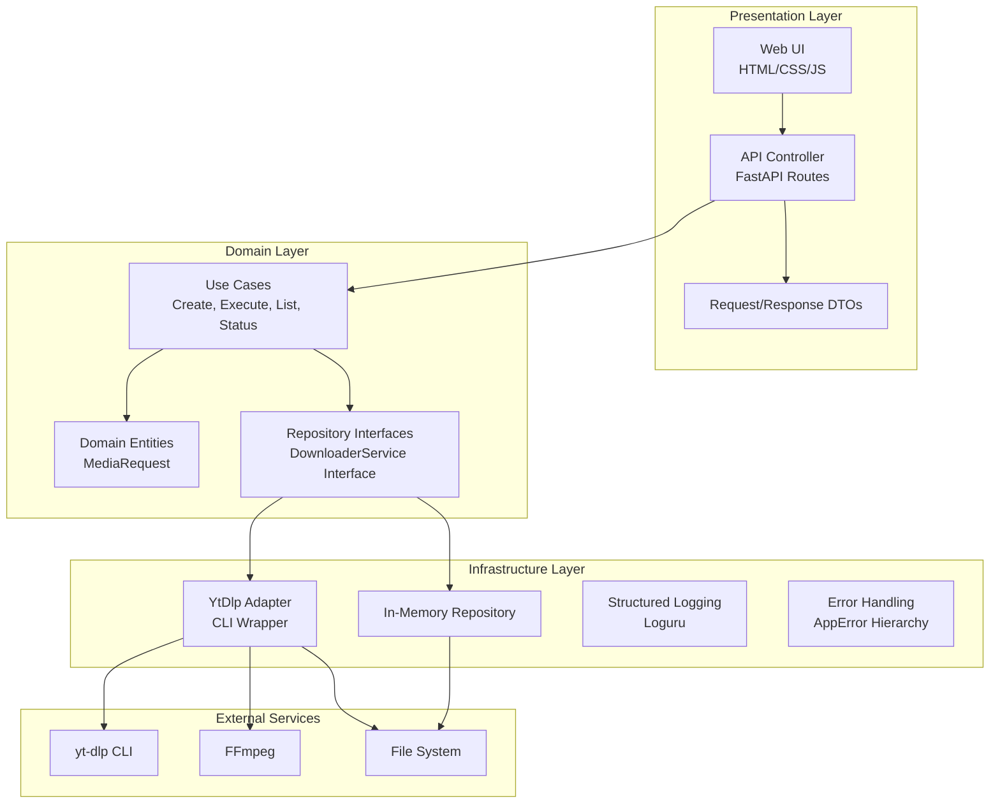

# 📥 Universal Media Downloader

[](https://www.python.org/downloads/)
[](https://fastapi.tiangolo.com/)
[](LICENSE)
[](https://www.docker.com/)
[](https://github.com/features/actions)

A production-ready, full-stack web application for downloading videos and audio from various platforms (YouTube, Vimeo, TikTok, and more). Built with Clean Architecture principles, featuring a modern web UI and RESTful API.

## 🏗️ System Architecture



### Architecture Principles

This project strictly follows **Clean Architecture** (also known as Hexagonal Architecture):

- **Domain Layer**: Pure business logic, 100% framework-independent. Contains entities, value objects, repository interfaces, and use cases.
- **Infrastructure Layer**: External service integrations (yt-dlp, FFmpeg), adapters, logging, and error handling.
- **Presentation Layer**: FastAPI controllers, DTOs, middleware, and a modern web UI.

**Dependency Rule**: Dependencies flow inward. The domain layer has zero dependencies on external frameworks.

## ✨ Features

- 🎥 **Multi-Platform Support**: Download from YouTube, Vimeo, TikTok, and 1000+ sites via yt-dlp
- 🎵 **Flexible Media Types**: Video only, audio only, or video with audio
- ⚙️ **Quality Selection**: Best, 1080p, 720p, 480p, 360p, or lowest quality
- 🎨 **Audio Format Options**: MP3, M4A, Opus, FLAC, WAV
- 🌓 **Modern Web UI**: Dark/Light theme with responsive design
- 🔄 **Real-Time Updates**: Live status polling and progress tracking
- 🚫 **Download Management**: Cancel or remove downloads
- 📊 **Metadata Preview**: View title, thumbnail, duration before downloading
- 🔍 **URL Validation**: Check if URLs are supported before downloading
- 🐳 **Docker Ready**: Production-ready containerization
- 📝 **Structured Logging**: Comprehensive logging with Loguru
- ✅ **Type-Safe**: Full type hints with Pydantic validation
- 🧪 **Well-Tested**: Comprehensive unit test suite with 95%+ coverage

## 📋 Prerequisites

### System Requirements

- **Python**: 3.10, 3.11, or 3.12
- **FFmpeg**: Required for audio extraction and video processing
- **yt-dlp**: Required for media downloading (auto-installed in Docker)
- **Operating System**: Windows 10+, macOS 10.15+, or Linux

### Installing FFmpeg

#### Windows

1. Download from [FFmpeg Official Site](https://ffmpeg.org/download.html)
2. Extract to `C:\ffmpeg`
3. Add `C:\ffmpeg\bin` to your system PATH
4. Verify: `ffmpeg -version`

#### macOS (using Homebrew)

```bash
brew install ffmpeg
ffmpeg -version
```

#### Ubuntu/Debian

```bash
sudo apt update
sudo apt install ffmpeg
ffmpeg -version
```

### Installing yt-dlp

#### Windows

```powershell
# Using pip
pip install yt-dlp

# Or download binary
curl -L https://github.com/yt-dlp/yt-dlp/releases/latest/download/yt-dlp.exe -o C:\Windows\System32\yt-dlp.exe
```

#### macOS

```bash
# Using Homebrew
brew install yt-dlp

# Or using pip
pip install yt-dlp
```

#### Ubuntu/Debian

```bash
sudo apt install yt-dlp
```

## 🚀 Installation & Setup

### 1. Clone the Repository

```bash
git clone https://github.com/yourusername/universal-media-downloader.git
cd universal-media-downloader
```

### 2. Create Virtual Environment

```bash
# Windows
python -m venv venv
venv\Scripts\activate

# macOS/Linux
python3 -m venv venv
source venv/bin/activate
```

### 3. Install Dependencies

```bash
pip install -r requirements.txt
```

### 4. Configure Environment

```bash
# Copy environment template
cp .env.example .env

# Edit .env with your settings
nano .env  # or use your preferred editor
```

### 5. Run the Application

```bash
# Development mode with auto-reload
uvicorn src.presentation.app:app --reload --host 0.0.0.0 --port 8000

# Production mode
uvicorn src.presentation.app:app --host 0.0.0.0 --port 8000 --workers 4
```

### 6. Access the Application

- **Web UI**: http://localhost:8000
- **API Documentation**: http://localhost:8000/docs
- **Alternative Docs**: http://localhost:8000/redoc
- **Health Check**: http://localhost:8000/api/v1/health

## 🐳 Docker Deployment

### Quick Start

```bash
# Build and start
docker-compose up -d

# View logs
docker-compose logs -f

# Stop
docker-compose down
```

### Build from Scratch

```bash
# Build image
docker build -t universal-media-downloader:latest .

# Run container
docker run -d \
  -p 8000:8000 \
  -v $(pwd)/downloads:/app/downloads \
  -v $(pwd)/logs:/app/logs \
  -e ENVIRONMENT=production \
  -e WORKERS=4 \
  --name umd-app \
  universal-media-downloader:latest
```

## 📚 API Reference

### Base URL

```
http://localhost:8000/api/v1
```

### Endpoints

#### 1. Create Download Request

```http
POST /downloads
```

**Request Body:**
```json
{
  "url": "https://www.youtube.com/watch?v=dQw4w9WgXcQ",
  "media_type": "video_with_audio",
  "video_quality": "best",
  "audio_format": "mp3",
  "output_directory": null,
  "filename_template": null
}
```

**Response (201 Created):**
```json
{
  "id": "abc123def456",
  "url": "https://www.youtube.com/watch?v=dQw4w9WgXcQ",
  "media_type": "video_with_audio",
  "video_quality": "best",
  "audio_format": "mp3",
  "status": "queued",
  "message": "Download request created and queued successfully."
}
```

#### 2. Get Download Status

```http
GET /downloads/{request_id}
```

**Response (200 OK):**
```json
{
  "id": "abc123def456",
  "url": "https://www.youtube.com/watch?v=dQw4w9WgXcQ",
  "media_type": "video_with_audio",
  "video_quality": "best",
  "audio_format": "mp3",
  "status": "completed",
  "download_path": "/downloads/Video Title.mp4",
  "error_message": null
}
```

#### 3. Execute Download

```http
POST /downloads/{request_id}/execute
```

**Response (200 OK):**
```json
{
  "id": "abc123def456",
  "status": "in_progress",
  "download_path": null,
  "error_message": null
}
```

#### 4. List All Downloads

```http
GET /downloads?limit=50&offset=0
```

**Response (200 OK):**
```json
{
  "items": [
    {
      "id": "abc123def456",
      "url": "https://www.youtube.com/watch?v=dQw4w9WgXcQ",
      "media_type": "video_with_audio",
      "status": "completed",
      "download_path": "/downloads/Video Title.mp4",
      "error_message": null
    }
  ],
  "pagination": {
    "total": 1,
    "limit": 50,
    "offset": 0,
    "has_more": false
  }
}
```

#### 5. Cancel Download

```http
POST /downloads/{request_id}/cancel
```

**Response (200 OK):**
```json
{
  "id": "abc123def456",
  "status": "cancelled",
  "message": "Download cancelled successfully."
}
```

#### 6. Validate URL

```http
POST /validate-url
```

**Request Body:**
```json
{
  "url": "https://www.youtube.com/watch?v=dQw4w9WgXcQ"
}
```

**Response (200 OK):**
```json
{
  "url": "https://www.youtube.com/watch?v=dQw4w9WgXcQ",
  "supported": true,
  "extractor": "youtube",
  "title": "Video Title"
}
```

#### 7. Fetch Metadata

```http
GET /metadata?url=https://www.youtube.com/watch?v=dQw4w9WgXcQ
```

**Response (200 OK):**
```json
{
  "title": "Video Title",
  "duration": 240,
  "uploader": "Channel Name",
  "upload_date": "20240101",
  "extractor": "youtube",
  "webpage_url": "https://www.youtube.com/watch?v=dQw4w9WgXcQ",
  "thumbnail": "https://i.ytimg.com/vi/dQw4w9WgXcQ/maxresdefault.jpg",
  "formats": [...],
  "raw": {...}
}
```

#### 8. Health Check

```http
GET /health
```

**Response (200 OK):**
```json
{
  "status": "healthy",
  "service": "universal-media-downloader"
}
```

### Error Responses

All errors follow a consistent structure:

```json
{
  "error": {
    "code": "VALIDATION_ERROR",
    "message": "URL must start with http:// or https://",
    "details": {}
  }
}
```

**Error Codes:**
- `VALIDATION_ERROR` (422): Invalid input data
- `RESOURCE_NOT_FOUND` (404): Requested resource doesn't exist
- `EXTERNAL_SERVICE_ERROR` (502): yt-dlp or FFmpeg failure
- `DOWNLOAD_EXECUTION_ERROR` (500): Download operation failed
- `FILE_SYSTEM_ERROR` (500): File system operation failed
- `REPOSITORY_ERROR` (500): Data persistence error
- `INTERNAL_ERROR` (500): Unexpected server error

## 🧪 Testing

### Run All Tests

```bash
pytest tests/ -v
```

### Run with Coverage

```bash
pytest tests/ -v --cov=src/ --cov-report=html
open htmlcov/index.html  # View coverage report
```

### Run Specific Test Files

```bash
# Domain entity tests
pytest tests/unit/test_media_request.py -v

# Repository tests
pytest tests/unit/test_in_memory_repository.py -v

# Use case tests
pytest tests/unit/test_create_download_request.py -v
pytest tests/unit/test_execute_download.py -v
pytest tests/unit/test_get_download_status.py -v
pytest tests/unit/test_list_downloads.py -v
```

### Test Coverage

Current test suite covers:
- ✅ Domain entity validation and state transitions
- ✅ Repository CRUD operations and pagination
- ✅ Use case business logic
- ✅ Error handling and edge cases
- ✅ Mock-based isolation testing

## 🔧 Configuration

### Environment Variables

| Variable | Default | Description |
|----------|---------|-------------|
| `APP_NAME` | "Universal Media Downloader" | Application name |
| `APP_VERSION` | "1.0.0" | Application version |
| `DEBUG` | `false` | Enable debug mode |
| `ENVIRONMENT` | "development" | Runtime environment |
| `HOST` | "0.0.0.0" | Server host |
| `PORT` | 8000 | Server port |
| `WORKERS` | 1 | Number of uvicorn workers |
| `CORS_ORIGINS` | "*" | Allowed CORS origins |
| `YT_DLP_PATH` | `null` | Custom yt-dlp path (auto-detect if null) |
| `FFMPEG_PATH` | `null` | Custom FFmpeg path (auto-detect if null) |
| `DOWNLOAD_DIR` | "./downloads" | Default download directory |
| `DOWNLOAD_TIMEOUT_SECONDS` | 600 | Download timeout (30-3600) |
| `LOG_LEVEL` | "INFO" | Logging level (DEBUG/INFO/WARNING/ERROR) |
| `LOG_FILE_PATH` | `null` | Log file path (stdout only if null) |
| `RATE_LIMIT_PER_MINUTE` | 30 | API rate limit |

## 🛠️ Development

### Project Structure

```
universal-media-downloader/
├── .github/
│   ├── workflows/
│   │   └── ci.yml                 # CI/CD pipeline
│   └── ISSUE_TEMPLATE/
│       ├── bug_report.md          # Bug report template
│       └── feature_request.md     # Feature request template
├── docs/                          # Documentation and diagrams
├── src/
│   ├── domain/                    # Enterprise business rules
│   │   ├── entities/              # Domain entities
│   │   │   ├── __init__.py
│   │   │   └── media_request.py   # MediaRequest entity
│   │   ├── interfaces/            # Repository/Service interfaces
│   │   │   ├── __init__.py
│   │   │   ├── media_repository.py
│   │   │   └── downloader_service.py
│   │   └── use_cases/             # Application business rules
│   │       ├── __init__.py
│   │       ├── create_download_request.py
│   │       ├── execute_download.py
│   │       ├── get_download_status.py
│   │       └── list_downloads.py
│   ├── infrastructure/            # External service adapters
│   │   ├── adapters/
│   │   │   ├── __init__.py
│   │   │   ├── yt_dlp_adapter.py  # yt-dlp CLI wrapper
│   │   │   └── in_memory_repository.py
│   │   ├── errors/
│   │   │   ├── __init__.py
│   │   │   └── app_errors.py      # Centralized error hierarchy
│   │   └── logging/
│   │       ├── __init__.py
│   │       └── logger.py          # Loguru wrapper
│   ├── config/
│   │   ├── __init__.py
│   │   └── settings.py            # Pydantic settings
│   └── presentation/              # API and Web UI
│       ├── app.py                 # FastAPI application factory
│       ├── api/
│       │   ├── __init__.py
│       │   ├── controllers/
│       │   │   ├── __init__.py
│       │   │   └── download_controller.py
│       │   ├── dtos/
│       │   │   ├── __init__.py
│       │   │   └── download_requests.py
│       │   └── middleware/
│       │       ├── __init__.py
│       │       ├── error_handler.py
│       │       └── logging_middleware.py
│       └── web/
│           ├── index.html
│           ├── css/
│           │   └── styles.css
│           └── js/
│               └── app.js
├── tests/
│   ├── __init__.py
│   ├── conftest.py                # Test fixtures
│   └── unit/
│       ├── __init__.py
│       ├── test_media_request.py
│       ├── test_in_memory_repository.py
│       ├── test_create_download_request.py
│       ├── test_execute_download.py
│       ├── test_get_download_status.py
│       └── test_list_downloads.py
├── .env.example                   # Environment template
├── .gitignore                     # Git ignore rules
├── Dockerfile                     # Multi-stage Docker build
├── docker-compose.yml             # Docker orchestration
├── requirements.txt               # Python dependencies
└── README.md                      # This file
```

### Code Quality

This project enforces strict code quality standards:

```bash
# Format code with Black
black src/ tests/

# Sort imports with isort
isort src/ tests/

# Lint with Flake8
flake8 src/ --max-line-length=100

# Type check with mypy
mypy src/ --strict
```

### Pre-commit Hooks

Install pre-commit hooks to enforce quality on every commit:

```bash
pip install pre-commit
pre-commit install
```

## 🤝 Contributing

We welcome contributions! Please follow these guidelines:

### Reporting Bugs

1. Check [existing issues](https://github.com/yourusername/universal-media-downloader/issues) to avoid duplicates
2. Use the [bug report template](.github/ISSUE_TEMPLATE/bug_report.md)
3. Include:
   - Clear description of the bug
   - Steps to reproduce
   - Expected vs actual behavior
   - Environment details (OS, Python version, etc.)
   - Logs or error messages

### Suggesting Features

1. Check [existing issues](https://github.com/yourusername/universal-media-downloader/issues) for similar requests
2. Use the [feature request template](.github/ISSUE_TEMPLATE/feature_request.md)
3. Describe the use case and expected behavior

### Development Workflow

1. **Fork the repository**

```bash
git clone https://github.com/yourusername/universal-media-downloader.git
cd universal-media-downloader
```

2. **Create a feature branch**

```bash
git checkout -b feature/amazing-feature
```

3. **Make your changes**
   - Follow the existing code style
   - Add tests for new functionality
   - Update documentation if needed

4. **Run tests and quality checks**

```bash
pytest tests/ -v
black src/ tests/
isort src/ tests/
flake8 src/
mypy src/ --strict
```

5. **Commit your changes**

```bash
git add .
git commit -m "feat: add amazing feature"
```

6. **Push to your fork**

```bash
git push origin feature/amazing-feature
```

7. **Open a Pull Request**
   - Go to the original repository
   - Click "New Pull Request"
   - Select your feature branch
   - Fill in the PR template with details

### Code Style Guidelines

- **Type Hints**: All functions must have type annotations
- **Docstrings**: All public classes and functions must have docstrings
- **Naming**: Use descriptive names (e.g., `create_download_request` not `create_dl`)
- **Error Handling**: Use the `AppError` hierarchy for consistent error responses
- **Testing**: Write unit tests for all business logic
- **SOLID Principles**: Follow dependency inversion and single responsibility

## 📊 Status Badges


## 🔒 Security

### Reporting Security Issues

If you discover a security vulnerability, please email **security@yourdomain.com** instead of opening a public issue.

### Security Best Practices

- Never commit `.env` files or secrets
- Use environment variables for sensitive configuration
- Keep dependencies updated (`pip list --outdated`)
- Run security audits: `pip-audit` or `safety check`

## 📄 License

This project is licensed under the **MIT License** - see the [LICENSE](LICENSE) file for details.

```
MIT License

Copyright (c) 2024 Universal Media Downloader Contributors

Permission is hereby granted, free of charge, to any person obtaining a copy
of this software and associated documentation files (the "Software"), to deal
in the Software without restriction, including without limitation the rights
to use, copy, modify, merge, publish, distribute, sublicense, and/or sell
copies of the Software, and to permit persons to whom the Software is
furnished to do so, subject to the following conditions:

The above copyright notice and this permission notice shall be included in all
copies or substantial portions of the Software.

THE SOFTWARE IS PROVIDED "AS IS", WITHOUT WARRANTY OF ANY KIND, EXPRESS OR
IMPLIED, INCLUDING BUT NOT LIMITED TO THE WARRANTIES OF MERCHANTABILITY,
FITNESS FOR A PARTICULAR PURPOSE AND NONINFRINGEMENT. IN NO EVENT SHALL THE
AUTHORS OR COPYRIGHT HOLDERS BE LIABLE FOR ANY CLAIM, DAMAGES OR OTHER
LIABILITY, WHETHER IN AN ACTION OF CONTRACT, TORT OR OTHERWISE, ARISING FROM,
OUT OF OR IN CONNECTION WITH THE SOFTWARE OR THE USE OR OTHER DEALINGS IN THE
SOFTWARE.
```

## 🙏 Acknowledgments

- **[yt-dlp](https://github.com/yt-dlp/yt-dlp)**: The powerful media downloader engine
- **[FFmpeg](https://ffmpeg.org/)**: Audio/video processing framework
- **[FastAPI](https://fastapi.tiangolo.com/)**: Modern, fast web framework
- **[Pydantic](https://docs.pydantic.dev/)**: Data validation using type annotations
- **[Loguru](https://loguru.readthedocs.io/)**: Python logging made easy

## 📞 Support

- **Documentation**: [docs/](docs/)
- **Issues**: [GitHub Issues](https://github.com/yourusername/universal-media-downloader/issues)
- **Discussions**: [GitHub Discussions](https://github.com/yourusername/universal-media-downloader/discussions)
- **Email**: support@yourdomain.com

## 🗺️ Roadmap

- [ ] Database persistence (PostgreSQL/SQLite)
- [ ] User authentication and authorization
- [ ] Download scheduling and queue management
- [ ] Batch download support
- [ ] Playlist download with metadata
- [ ] Subtitle extraction
- [ ] Thumbnail download
- [ ] Progress tracking with WebSockets
- [ ] Mobile-responsive PWA
- [ ] Browser extension
- [ ] Multi-language support (i18n)
- [ ] Plugin system for custom extractors

---

**Built with ❤️ by the Universal Media Downloader Contributors**

*Last updated: 2024*